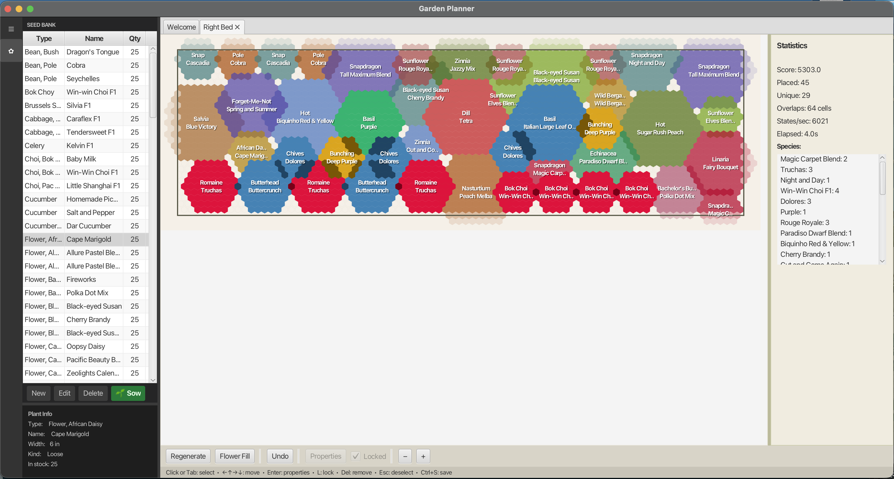

# Garden Planner

A JavaFX desktop app for optimizing plant placement in raised garden beds. Seeds are loaded from a global seed bank, arranged on a hexagonal grid divided into zones, and a search engine finds the best non-overlapping layout.



## Requirements

- Java 21+
- Maven 3.8+

## Quick Start

### 1. Build and run

```bash
mvn -f garden-planner/pom.xml javafx:run
```

### 2. Create a project

On the start screen, click **New Project** and give it a name and location. This creates a `.garden` project folder.

### 3. Add a bed

In the left sidebar, click **New Bed**. Set the bed name, dimensions (rows × columns), and zones (Back / Middle / Front).

### 4. Add plants and run the optimizer

Open a bed tab and click **Add Plants** to pick from the seed bank. Then click **Run** — the optimizer places all plants on the hex grid with minimal overlap.

### 5. Interact with the layout

| Action | Key / Mouse |
|--------|-------------|
| Select a plant | Click or Tab |
| Move selected plant | Arrow keys |
| Lock plant in place | L |
| Edit plant properties | Enter |
| Duplicate plant | D |
| Remove plant | Delete |
| Deselect | Escape |
| Zoom | Scroll wheel |
| Save | Ctrl+S |

## Project Structure

```
garden-planner/      # JavaFX app (Maven project)
  src/
    core/geometry/   # Hex grid math (odd-r offset coordinates)
    core/search/     # LocalSearchEngine, GreedyLnsEngine
    data/            # CSV loading, JSON save/restore
    gui/             # MainController, BedEditorPane, BedCanvas
saves/               # JSON placement saves (written at runtime)
```

## Feature Requests

Planned features and ideas are tracked in [GitHub Issues](https://github.com/ryndvs96/garden/issues).

## Running Tests

```bash
mvn -f garden-planner/pom.xml clean test
```
